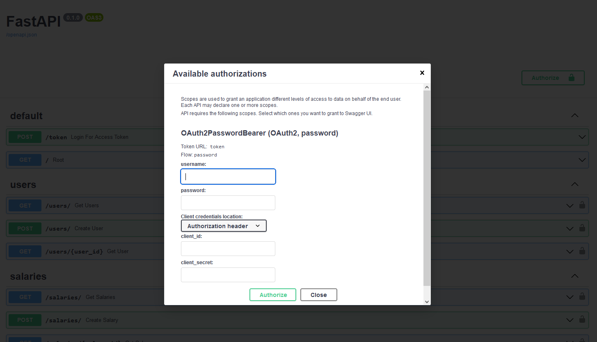

# Docker / FastAPI / SQLite

Create a micro-service to address some functionality which is useful to derive simplified summary statistics (mean, min, max) on a dataset. 

## Guiding Principles

- Local development - The entire infrastructure must easily run locally for end-to-end testing

## Production Deployment Notes
- local run
```
uvicorn app.main:app --host 0.0.0.0 --port 8000
```
- Docker run
```
docker-compose up -d --build
```

## Docker

Delete all Docker related stuff, start over
```
docker container stop $(docker container ls -aq); docker container rm $(docker container ls -aq); docker image prune -a -f 
```
## API docs

http://localhost:8000/docs




